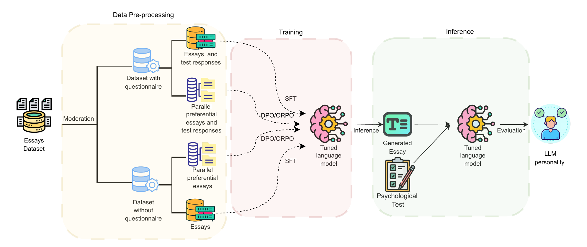
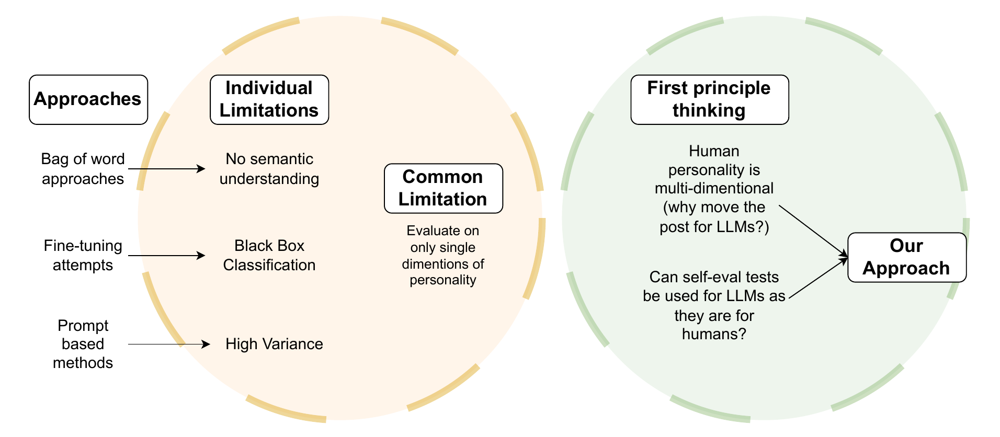
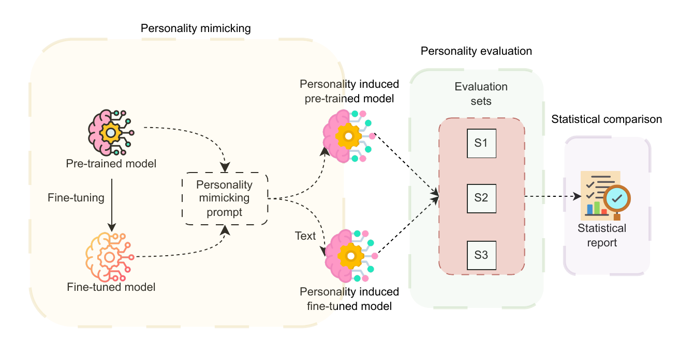
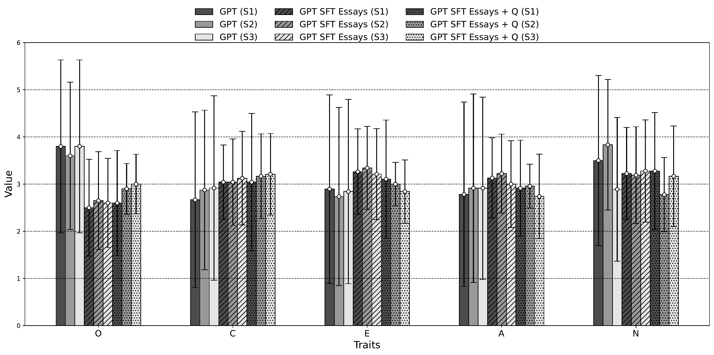

# Evaluation Drift in LLM Personality Induction: Are We Moving the Goalpost?

Code repository for reproducibility of results presented in our LREC-COLING 2026 paper.

> **Abstract:** Can large language models reliably express a human-like personality, or are they merely mimicking surface cues without a stable underlying profile? We induce personality in LLMs by fine-tuning them on long-form essays associated with Big Five personality profiles. We then evaluate the stability and fidelity of the induced personality using the IPIP-NEO questionnaire. Our results show that fine-tuning consistently reduces variance in questionnaire responses, but accuracy on the full five-dimensional profile remains near chance.

---

## Overview


*Full pipeline for personality induction: from essays dataset through SFT/DPO/ORPO training to IPIP-NEO evaluation.*

### Research Questions

- **RQ1:** Does fine-tuning reduce statistical variance in LLM responses to personality questionnaires?
- **RQ2:** Can supervised or preferential fine-tuning using unguided text induce personality in LLMs?
- **RQ3:** Does security alignment significantly impact personality induction efficacy?

### Approach


*Existing personality induction approaches, their limitations, and the motivation behind our approach.*

---

## Repository Structure

```
personality_induction/
├── config.yaml                    # API keys (HuggingFace, OpenAI, WandB)
├── requirements.txt               # Python dependencies
├── preprocessing/
│   ├── moderation.py              # OpenAI content moderation + SFT data creation
│   ├── create_dpo_dataset.py      # DPO/ORPO preference pair generation
│   └── create_sft_with_questions_dataset.py  # SFT variant with questionnaire context
├── train.py                       # Training script (SFT, DPO, ORPO)
├── inference.py                   # Inference + evaluation pipeline
├── evaluate.py                    # Results analysis and comparison
├── utils_traits_eval.py           # Per-trait accuracy evaluation utilities
├── utils_full_eval.py             # Full 5D profile evaluation utilities
├── smoke_test.py                  # Quick verification that training pipelines work
└── figures/                       # Paper figures
```

---

## Setup

### 1. Install Dependencies

```bash
pip install -r requirements.txt
```

Tested with Python 3.10+, CUDA 12.1, PyTorch 2.0+.

### 2. Configure API Keys

Edit `config.yaml` with your credentials:

```yaml
openai:
  api_key: "your-openai-key"      # For content moderation (preprocessing only)

huggingface:
  token: "your-hf-token"          # For gated model access (Llama, Gemma)

wandb:
  wandb_key: "your-wandb-key"     # Optional, for experiment tracking
```

### 3. Data

Place the following in `./data/`:
- `essays.csv` — The [Essays Dataset](https://www.kaggle.com/datasets/srkm09/personality-big5-essays) (Pennebaker & King, 1999)
- `questions.json` — IPIP-NEO questionnaire items with train/test splits
- `essays_post_openai_moderation.csv` — Essays with moderation flags (or generate via `moderation.py`)

---

## Data Preparation

### Step 1: Content Moderation (optional, pre-computed file provided)

Filter essays through OpenAI's moderation API and create SFT train/val/test splits:

```bash
python preprocessing/moderation.py \
  --essays_path ./data/essays.csv \
  --config_path ./config.yaml \
  --essays_with_moderation_save_path ./data/essays_post_openai_moderation.csv \
  --path_to_folder_to_save_jsonl_files ./data/
```

**Output:** `train.jsonl`, `validation.jsonl`, `test.jsonl` in `./data/`

### Step 2: Create DPO/ORPO Preference Dataset

Generate preference pairs (3 rejected per chosen essay, ~6.3k pairs):

```bash
python preprocessing/create_dpo_dataset.py \
  --essays_path ./data/essays_post_openai_moderation.csv \
  --output_dir ./data/ \
  --num_rejected 3
```

**Output:** `dpo_train_dataset.json`, `dpo_test_dataset.json`

### Step 3: Create SFT Dataset with Questionnaire Fragments (optional variant)

```bash
python preprocessing/create_sft_with_questions_dataset.py \
  --essays_path ./data/essays_post_openai_moderation.csv \
  --questions_path ./data/questions.json \
  --output_dir ./data/
```

**Output:** `train_with_questions.jsonl`, `validation_with_questions.jsonl`, `test_with_questions.jsonl`

---

## Training

### Models

| Model | Size | Context | HuggingFace ID |
|-------|------|---------|----------------|
| Gemma-2-2B | 2B | 8,192 | `google/gemma-2-2b` |
| Llama 3.2-3B | 3B | 128,000 | `meta-llama/Llama-3.2-3B-Instruct` |
| Gemma-7B | 7B | 8,192 | `google/gemma-7b` |
| Llama 3.1-8B | 8B | 8,000 | `meta-llama/Llama-3.1-8B` |

### Supervised Fine-Tuning (SFT)

LoRA (r=8, dropout 0.1) on `q_proj` and `v_proj`, 3 epochs, lr=1e-5:

```bash
python train.py \
  --training_method SFT \
  --model llama-3.2-3b \
  --train_file ./data/train.jsonl \
  --validation_file ./data/validation.jsonl \
  --output_dir ./results
```

For the variant with questionnaire fragments:

```bash
python train.py \
  --training_method SFT \
  --model llama-3.2-3b \
  --train_file ./data/train_with_questions.jsonl \
  --validation_file ./data/validation_with_questions.jsonl \
  --output_dir ./results
```

### Direct Preference Optimization (DPO)

QLoRA (4-bit nf4, r=16) on attention + MLP layers, 3 epochs:

```bash
python train.py \
  --training_method DPO \
  --model llama-3.2-3b \
  --dpo_train_file ./data/dpo_train_dataset.json \
  --output_dir ./results
```

### Odds Ratio Preference Optimization (ORPO)

Same QLoRA config as DPO, no reference model:

```bash
python train.py \
  --training_method ORPO \
  --model llama-3.2-3b \
  --dpo_train_file ./data/dpo_train_dataset.json \
  --output_dir ./results
```

### Train All Models at Once

```bash
python train.py --training_method SFT --model all --train_file ./data/train.jsonl --validation_file ./data/validation.jsonl
```

### Additional Options

| Flag | Description |
|------|-------------|
| `--num_epochs N` | Number of training epochs (default: 3) |
| `--max_steps N` | Stop after N steps (-1 for full epochs) |
| `--no_wandb` | Disable Weights & Biases logging |

---

## Inference & Evaluation

### Prompt Variation Study (RQ1)


*Three prompt templates (S1: numeric, S2: string, S3: letter) used to study evaluation stability.*

### Running Inference

Evaluate a model on all 32 Big Five profiles:

```bash
# Base model evaluation
python inference.py \
  --model_path google/gemma-2-2b \
  --questions_path ./data/questions.json \
  --prompt_set S1 \
  --with_essay \
  --output_dir ./eval_results

# Fine-tuned model evaluation (PEFT adapter)
python inference.py \
  --model_path ./results/sft_llama-3.2-3b/final \
  --base_model meta-llama/Llama-3.2-3B-Instruct \
  --questions_path ./data/questions.json \
  --prompt_set S1 \
  --with_essay \
  --output_dir ./eval_results
```

### Analyzing Results

```bash
# Full analysis
python evaluate.py --results_dir ./eval_results

# Specific analyses
python evaluate.py --results_dir ./eval_results --analysis variance exact_match per_trait nan

# Compare prompt sets for a specific model
python evaluate.py --results_dir ./eval_results --analysis prompt_comparison --model_name sft_llama-3.2-3b
```

---

## Key Results

### RQ1: Variance Reduction


*Standard deviation in questionnaire responses across prompt formats. Fine-tuning reduces variance by 15-33%.*

| Setting | Llama-3.2-3B (S1/S2/S3) | Gemma-2-2B (S1/S2/S3) | Gemma-7B (S1/S2/S3) | GPT-3.5 (S1/S2/S3) |
|---------|--------------------------|------------------------|---------------------|---------------------|
| Pre-trained | 1.86 / 1.65 / 1.88 | 1.90 / 1.91 / 1.78 | 1.62 / 1.68 / 1.76 | 1.80 / 1.52 / 1.81 |
| SFT (Essays) | **1.40** / 1.41 / 1.44 | 1.46 / 1.44 / **1.28** | 1.33 / 1.38 / **1.32** | **1.23** / 1.24 / 1.30 |
| SFT (Essays+Q) | 1.42 / **1.30** / **1.35** | **1.40** / **1.28** / 1.29 | **1.19** / **1.29** / 1.42 | 1.32 / **1.22** / **1.21** |

### RQ2: Personality Induction Accuracy

Full 5D profile exact match remains near chance (random baseline: 3.125%):

| Model | Base | SFT | DPO | ORPO |
|-------|------|-----|-----|------|
| gemma-2-2b | 3.13% (1/32) | 3.13% (1/32) | 0.00% (0/32) | 3.13% (1/32) |
| gemma-7b | 9.38% (3/32) | 6.25% (2/32) | 3.13% (1/32) | 3.13% (1/32) |
| llama-3.2-3b | 0.00% (0/32) | 3.13% (1/32) | 3.13% (1/32) | 3.13% (1/32) |
| llama-3.1-8b | 6.25% (2/32) | 6.25% (2/32) | 3.13% (1/32) | 6.25% (2/32) |
| GPT-3.5 | 3.13% (1/32) | 3.13% (1/32) | -- | -- |

### RQ3: Security Alignment

Censored vs. uncensored models show comparable performance — security alignment is not a bottleneck.

---

## Evaluation Details

### 32 Personality Profiles

We evaluate all 2^5 = 32 possible Big Five binary combinations (each OCEAN trait as positive/negative).

### Scoring Pipeline

1. **Essay Generation:** Model generates a personality-conditioned essay
2. **Questionnaire:** Model answers IPIP-NEO test items using the essay as context
3. **Score Extraction:** Responses are parsed (numeric, string, or letter format)
4. **Trait Classification:** Average score per trait, threshold at 3.0 for positive/negative
5. **Profile Matching:** Compare predicted 5D vector against target

### NaN Handling

If a model response doesn't follow the expected format, it is marked as NaN and excluded from scoring. Typical NaN rate: 6-10%.

---

## Hyperparameters

| Parameter | SFT | DPO / ORPO |
|-----------|-----|------------|
| LoRA rank | 8 | 16 |
| LoRA alpha | 32 | 32 |
| LoRA dropout | 0.1 | 0.05 |
| Quantization | FP16 | QLoRA (4-bit nf4) |
| Learning rate | 1e-5 | 8e-6 |
| Optimizer | AdamW | AdamW |
| Batch size | 2 (x4 grad accum) | 2 (x4 grad accum) |
| Epochs | 3 | 3 |
| Max sequence length | 4,000 tokens | 4,000 tokens |
| Warmup steps | 500 | 500 |
| Inference temperature | 0 (greedy) | 0 (greedy) |

---

## Quick Verification

Run a smoke test to verify all training pipelines work with your hardware:

```bash
python smoke_test.py
```

This loads Gemma-2-2B and Llama-3.2-3B, runs 3 steps each of SFT, DPO, and ORPO, and reports pass/fail.

---

## Citation

```bibtex
@inproceedings{personality-induction-lrec2026,
  title     = {Evaluation Drift in {LLM} Personality Induction: Are We Moving the Goalpost?},
  booktitle = {Proceedings of the 2026 Joint International Conference on Computational Linguistics, Language Resources and Evaluation (LREC-COLING 2026)},
  year      = {2026},
}
```

## License

MIT License. See the paper's Ethics Statement for responsible use guidelines.
